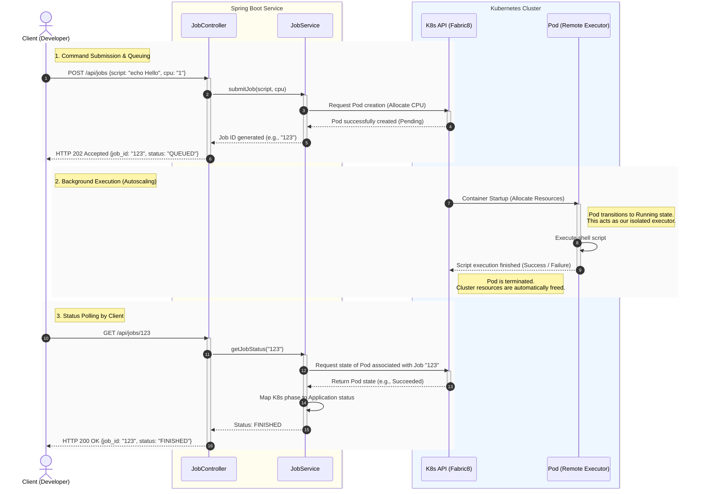

# TeamCity Cloud: Remote Shell Executor

A lightweight, scalable backend service designed to orchestrate and execute shell commands on remote virtual environments. This project simulates the core autoscaling behavior of CI/CD agents, dynamically provisioning executors based on user demand.

## 🚀 Architecture Overview
To ensure scalability, isolation, and efficient resource allocation, this service leverages **Kubernetes Pods** as remote executors. 

The application is built with **Kotlin** and **Spring Boot**, utilizing the `Fabric8 Kubernetes Client` to programmatically interact with the Kubernetes API.

### System Workflow (Autoscaling Sequence)

    🛠 Tech Stack
Language: Kotlin

Framework: Spring Boot 3

Orchestration: Kubernetes (Minikube / Docker Desktop)

K8s Integration: Fabric8 Kubernetes Client

📦 API Documentation
1. Execute a Command
Starts a new remote executor and runs the provided script.

POST /api/jobs
{
  "script": "echo 'Hello from TeamCity Cloud!' && sleep 5",
  "cpuRequest": "500m"
}
Response (202 Accepted):
{
  "jobId": "123e4567-e89b-12d3-a456-426614174000",
  "status": "QUEUED"
}

2. Check Execution Status
Retrieves the current state of the execution.

GET /api/jobs/{jobId}

Response (200 OK):
{
  "jobId": "123e4567-e89b-12d3-a456-426614174000",
  "status": "IN_PROGRESS" 
}
(Status enum: QUEUED, IN_PROGRESS, FINISHED)

⚙️ Local Setup & Running
Prerequisites
Java 17+ installed.

Minikube or Docker Desktop with Kubernetes enabled.

kubectl configured and connected to your local cluster.

Steps to Run
Start your local Kubernetes cluster:
