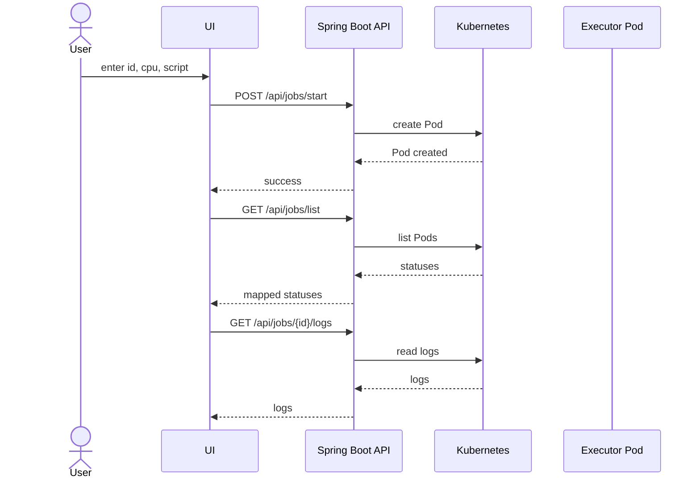

# TeamCity Cloud: Remote Shell Executor

A lightweight backend service that executes shell commands on a **temporary remote executor implemented as a Kubernetes Pod** and tracks the execution lifecycle.

The project models the core idea behind autoscaling build agents in **TeamCity Cloud**: when a user submits a job, the service provisions an isolated executor, waits until it becomes ready, runs the script, and exposes the job status through a REST API.

---

## Overview

The service is implemented in **Kotlin** with **Spring Boot** and uses **Kubernetes Pods** as remote executors.

A user can:

- submit a shell script to be executed
- specify the required resources for the executor, for example CPU count
- check the execution status: `QUEUED`, `IN_PROGRESS`, `FINISHED`, or `FAILED`
- inspect execution logs
- terminate the executor pod manually

The service:

- creates a new remote executor Pod for each submitted job
- waits until the Pod is initialized and ready
- executes the shell script inside the container
- updates and exposes the current job status
- allows the Pod to be deleted after execution to free resources

---

## Architecture

This implementation uses a **Kubernetes Pod** as the remote executor.

Main components:

- **JobController** — REST API for submitting jobs, retrieving logs, listing jobs, and deleting executors
- **JobService** — application logic for validation, lifecycle management, status mapping, and Kubernetes interaction
- **Kubernetes API Client (Fabric8)** — integration layer used to create, inspect, and delete Pods
- **Remote Executor Pod** — temporary Pod where the shell script is executed

---

## System Workflow


## Job Lifecycle
The application tracks the lifecycle of each submitted job and maps raw Kubernetes Pod states to simpler business statuses shown in the UI.

```text
QUEUED -> IN_PROGRESS -> FINISHED -> FAILED
```

**Suggested meaning of states:**
- **QUEUED** — request accepted, executor Pod is being scheduled or started
- **IN_PROGRESS** — Pod is running and the script is executing
- **FINISHED** — execution completed successfully
- **FAILED** — pod creation or script execution failed

---

## REST API

### Submit a job
**POST** `/api/jobs/start`

**Request body:**
```json
{
  "id": "web-task-101",
  "script": "echo Hello && sleep 5 && echo Done",
  "cpu": "1"
}
```

**Example success response:**
```text
✅ Job web-task-101 successfully submitted with CPU=1.
```

### List jobs
**GET** `/api/jobs/list`

**Example response:**
```json
[
  {
    "id": "web-task-101",
    "name": "worker-pod-web-task-101",
    "status": "FINISHED"
  }
]
```

### Get job logs
**GET** `/api/jobs/{id}/logs`

**Example response:**
```text
Hello
Done
```

### Delete a job
**DELETE** `/api/jobs/{id}`

**Example response:**
```text
✅ Job web-task-101 has been deleted from the cluster.
```

---

## Validation Rules

### Job ID
**Allowed format:**
- lowercase letters
- numbers
- hyphens

**Examples:**
- ✅ Valid: `web-task-101`, `job-1`
- ❌ Invalid: `webTask101`, `Job_1`, `task 1`

### CPU
**Allowed values:**
- numeric only
- greater than 0
- less than or equal to 8

**Examples:**
- ✅ Valid: `0.5`, `1`, `2`

---

## Technology Stack

- **Language:** Kotlin
- **Framework:** Spring Boot 3
- **Executor model:** ephemeral Kubernetes Pods
- **Kubernetes client:** Fabric8 Kubernetes Client
- **Frontend:** HTML + JavaScript + Bootstrap 5
- **Build tool:** Gradle

---

## Tested Environment

This project was tested with:
- Windows 11 host machine
- IntelliJ IDEA
- Ubuntu virtual machine
- MicroK8s
- Remote cluster access through a valid kubeconfig

---

## Local Development

### Prerequisites
- Java 17+
- Gradle or Gradle Wrapper
- Access to a Kubernetes cluster
- Valid `kubeconfig` (tested with MicroK8s on Ubuntu VM)

### Run locally
Using Windows PowerShell:

```powershell
$env:KUBECONFIG="C:\Users\YOUR_USER\.kube\config"
.\gradlew.bat bootRun
```

Then open your browser at: `http://localhost:8080`

---

## Example Demo Job

- **Job ID:** `web-task-200`
- **CPU:** `1`
- **Script:**
  ```bash
  echo Hello && sleep 3 && echo Done
  ```

---

## Current Capabilities

The current MVP supports:
- creating a temporary executor Pod
- executing a user-provided shell script
- assigning CPU resources
- status tracking
- log retrieval
- manual executor deletion
- input validation on both frontend and backend
- unit and controller tests

---


## Notes

This project uses Kubernetes Pods instead of full virtual machines. This is a valid remote executor model for a lightweight MVP. The general autoscaling idea remains similar to VM-based provisioning systems, but Pods offer faster startup and simpler demo deployment.

---

## Documentation

Additional technical documentation can be placed in:
`docs/PROJECT_DOCUMENTATION.md`

---

## Author

Developed as a test task / internship project focused on remote execution and Kubernetes-based executor orchestration.
