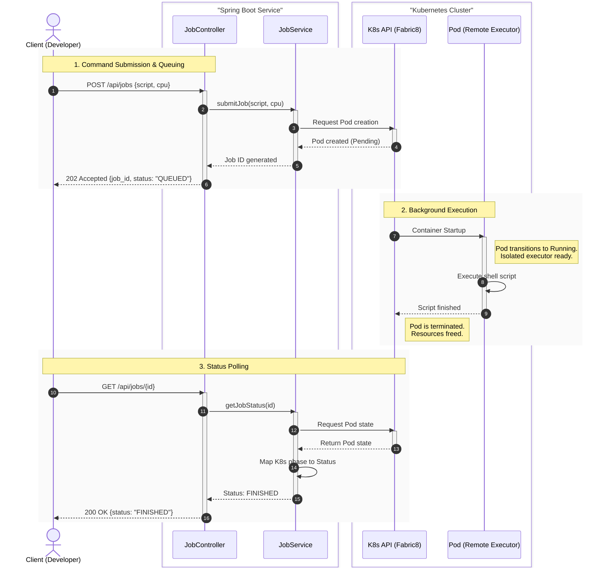

# TeamCity Cloud: Remote Shell Executor

A lightweight backend service that executes shell commands on a **remote virtual machine** and tracks the execution lifecycle. The project models the core idea behind autoscaling build agents in **TeamCity Cloud**: when a user submits a job, the service provisions an isolated executor, waits until it becomes ready, runs the script, and exposes the job status through a REST API.

## Overview

The service is implemented in **Kotlin** with **Spring Boot**.

A user should be able to:

- submit a shell command to be executed
- specify the required resources for the executor, for example CPU count
- check the execution status: `QUEUED`, `IN_PROGRESS`, or `FINISHED`

The service should:

- create a new remote VM for each submitted job
- wait until the VM is initialized and ready
- execute the shell script on that VM
- update and expose the current job status
- terminate the VM after execution to free resources

## Architecture

This implementation assumes that the remote executor is a **virtual machine** managed by a cloud provider or a VM provisioning layer.

Main components:

- **JobController** — REST API for submitting jobs and retrieving status
- **JobService** — application logic for job lifecycle management
- **VM Provisioner Client** — integration with the cloud or virtualization API
- **Remote Executor VM** — temporary machine where the shell command is executed

## System Workflow

## Job Lifecycle

text
QUEUED -> IN_PROGRESS -> FINISHED


Suggested meaning of states:

- `QUEUED` — request accepted, VM is being provisioned
- `IN_PROGRESS` — VM is ready and the script is running
- `FINISHED` — execution completed and the result is available

## REST API

### Submit a job

**POST** `/api/jobs`

Request body:

```json
{
  "script": "echo 'Hello from TeamCity Cloud' && sleep 5",
  "cpuRequest": "2"
}
```

Example response:

```json
{
  "jobId": "123e4567-e89b-12d3-a456-426614174000",
  "status": "QUEUED"
}
```

### Get job status

**GET** `/api/jobs/{jobId}`

Example response:

```json
{
  "jobId": "123e4567-e89b-12d3-a456-426614174000",
  "status": "IN_PROGRESS"
}
```

## Technology Stack

- **Language:** Kotlin
- **Framework:** Spring Boot 3
- **Executor model:** ephemeral remote virtual machines
- **Communication with VM:** SSH or lightweight agent
- **Build tool:** Gradle

## Local Development

### Prerequisites

- Java 17+
- Gradle or Gradle Wrapper
- access to a VM provider API or a mocked provisioner for local testing

### Run locally

```bash
./gradlew bootRun
```

## Notes

- For local development, the VM provisioning layer can be mocked.
- In a production-ready version, job results, logs, retries, and timeouts should be persisted.
- If you later decide to implement the executor with Kubernetes pods instead of VMs, only the provisioning layer changes; the overall job lifecycle remains almost the same.
